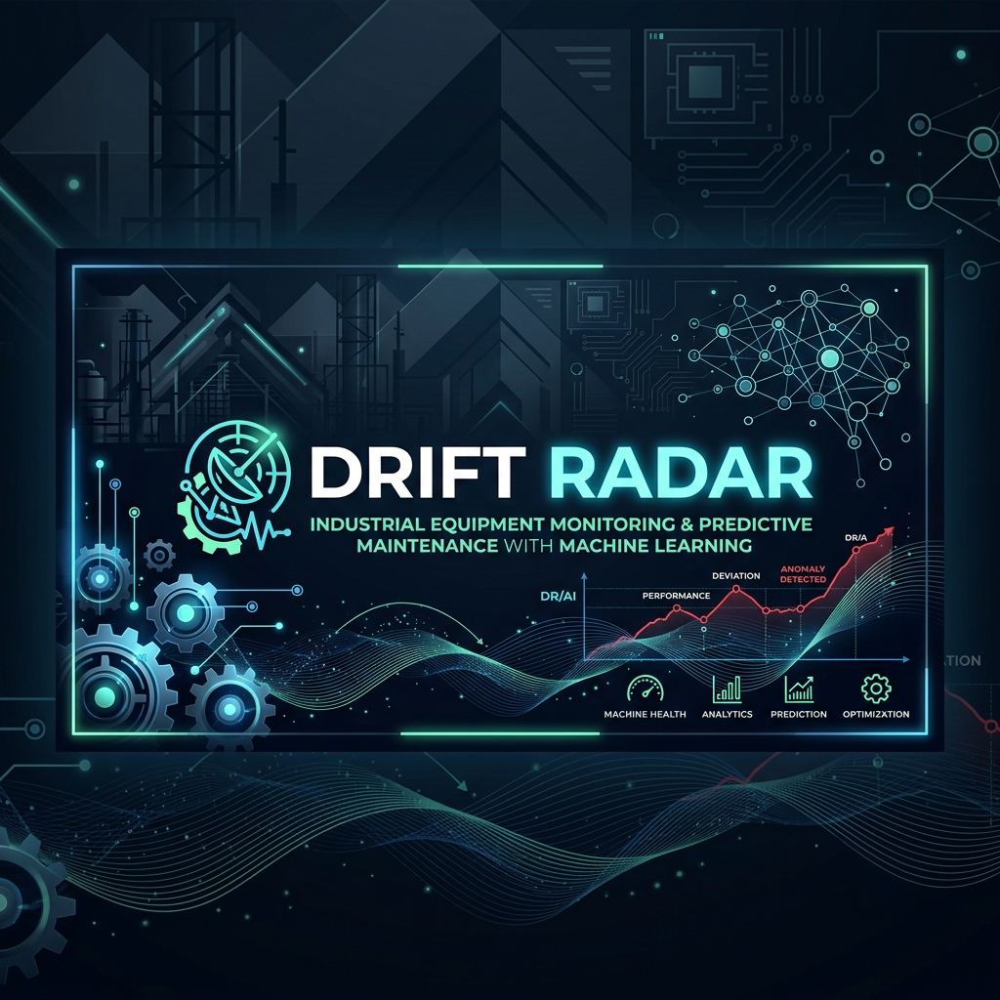

<div align="center">

# ⚡ Drift Radar — Industrial Equipment Failure & Text Analysis Hub

**Deployed App:** [drift-radar.app](https://mechanic-notes-drift-radar-project.streamlit.app/)

[](https://git.io/typing-svg)


<br/>

[](https://mechanic-notes-drift-radar-project.streamlit.app/)
[](https://github.com/mayank-goyal09/mechanic-notes-drift-radar/stargazers)
[](https://github.com/mayank-goyal09/mechanic-notes-drift-radar/network)

<br/>



<br/>

### 🧠 **Using HDBSCAN Density-Based Clustering to group mechanic logs** 

### **From Raw Maintenance Notes → Real-Time Failure & Drift Diagnosis** 🏭

</div>

---

## ⚡ **THE ANALYSIS AT A GLANCE**

<table>
<tr>
<td width="50%">

### 🎯 **What This Project Does**

**Drift Radar** is a machine learning dashboard designed to process unstructured mechanic repair notes, clean industrial jargon, automatically cluster failures using **HDBSCAN**, extract key concepts using **YAKE**, and flag newly emerging failure modes (data drift) in real-time.

**The ML Pipeline:**
- 🧹 **Text Preprocessing** → Expand shorthand (e.g. `hydr` -> `hydraulic`) and strip numeric noise
- 🔢 **Vectorization** → TF-IDF n-grams feature extraction
- 🧬 **Clustering** → HDBSCAN density-based clustering to automatically group similar failure modes without needing a predefined $K$ value
- 🏷️ **Auto-Labeling** → YAKE keyword extraction to identify core engineering themes of each cluster
- 🚨 **Drift Simulation** → Injects high-frequency anomalous logs to test the model's re-clustering detection

</td>
<td width="50%">

### ✨ **Key Highlights**

| Feature | Details |
|---------|---------|
| ⚙️ **Clustering Control** | Real-time HDBSCAN parameter tuning (Min Cluster Size, Min Samples) |
| 📊 **Failure Topology** | 2D PCA cluster scatter maps and frequency plots |
| 🚨 **Drift Simulator** | Inject and detect new failure categories on-the-fly |
| 🧠 **Real-Time Diagnosis** | Classify new mechanic notes with prediction confidence |
| 🎨 **UI Design** | Dark theme, glassmorphism, and neon accents |
| 💾 **Caching** | Cached data generation & model resource fit pipelines |
| 📉 **Noise Handling** | Excludes unrelated notes as outliers/noise |

</td>
</tr>
</table>

---

## 🛠️ **TECHNOLOGY STACK**

<div align="center">


</div>

| **Category** | **Technologies** | **Purpose** |
|:------------:|:-----------------|:------------|
| 🐍 **Core Language** | Python 3.13+ | Primary development language |
| 🧬 **Clustering Engine** | HDBSCAN | Outlier-resilient density clustering |
| 🏷️ **Keywords** | YAKE | Automated keyword and metadata extraction |
| 🎨 **Frontend** | Streamlit | Interactive, customized web application dashboard |
| 📈 **Visualization** | Plotly | Interactive PCA scatter plots, gauges, and bar charts |
| ⚡ **NLP & Vectors** | Scikit-Learn | TF-IDF Vectorizer and PCA dimensionality reduction |
| 📂 **Data Handling** | Pandas / NumPy | Data structuring, filtering, and synthetic simulation |

---

## 🔬 **HOW DRIFT RADAR WORKS**


### **The Pipeline Breakdown:**

<table>
<tr>
<td>

#### 🧹 **1. Preprocessing & Clean**
Removes machine serial codes and punctuation, converts text to lowercase, and maps mechanic shorthand abbreviations (like `hydr` -> `hydraulic`, `repl` -> `replace`, `vibr` -> `vibration`, `noisy` -> `noise`).

</td>
<td>

#### 🔢 **2. Feature Vectorization**
Extracts word and bi-gram patterns using `TfidfVectorizer` to represent each log numerically based on semantic importance.

</td>
</tr>
<tr>
<td>

#### 🧬 **3. Density-Based Clustering**
Runs `HDBSCAN` on the dense TF-IDF vectors, automatically isolating stable clusters of failure categories while filtering out outliers as uncategorized noise.

</td>
<td>

#### 📊 **4. Auto-Labeling & Diagnostics**
Extracts keywords from clustered logs via `YAKE` to dynamically label failure modes. Predicts clusters for new logs and detects emerging concepts (drift) when anomalous clusters form.

</td>
</tr>
</table>

---

## 📂 **PROJECT STRUCTURE**

```
⚡ Drift Radar/
│
├── 📊 app.py                        # Main Streamlit application, page config, custom CSS & UI tabs
├── 🧠 main.ipynb                    # Jupyter Notebook for experimental model testing & EDA
│
├── 📁 assets/
│   └── 🖼️ drift_radar_banner.png   # Project banner image
│
├── 📁 data/
│   ├── 📄 raw_repair_logs.csv       # Pre-split/original synthetic repair logs
│   └── 📄 processed_repair_logs.csv # Cleaned repair logs with pipeline cached output
│
├── 📦 requirements.txt             # Project dependencies
└── 📖 README.md                     # You are here! 🎉
```

---

## 🚀 **QUICK START GUIDE**

### **Step 1: Clone the Repository** 📥

```bash
git clone https://github.com/mayank-goyal09/mechanic-notes-drift-radar.git
cd mechanic-notes-drift-radar
```

### **Step 2: Create Virtual Environment** 🐍

```bash
python -m venv venv
venv\Scripts\activate      # On Windows
source venv/bin/activate   # On macOS/Linux
```

### **Step 3: Install Dependencies** 📦

```bash
pip install -r requirements.txt
```

### **Step 4: Launch Drift Radar** ⚡

```bash
streamlit run app.py
```

---

## 📚 **SKILLS DEMONSTRATED**

| **Category** | **Skills** |
|:-------------|:-----------|
| 🧠 **Unstructured Text NLP** | Regular expressions cleanups, jargon mapping, TF-IDF n-gram embeddings |
| 🔮 **Density-Based Clustering** | Hyperparameter tuning (Min Cluster Size, Min Samples) with HDBSCAN |
| 📊 **Dimensionality Reduction** | Visualizing high-dimensional TF-IDF vectors using Principal Component Analysis (PCA) |
| 🏷️ **Keyword Extraction** | Statistical unsupervised metadata labeling using YAKE |
| 🎨 **UI/UX Customization** | Advanced glassmorphism Streamlit layouts, pulsing status elements, and custom CSS |
| 🚨 **ML Drift Simulation** | Simulating high-frequency data drifts and dynamically generating re-clustering plots |

---

## 🔮 **FUTURE ENHANCEMENTS**

- [ ] 🤖 **LLM Maintenance Assistant**: Integrating local Ollama models to summarize repair tasks and suggest solutions.
- [ ] 🔌 **API Integration**: Creating REST API endpoints to receive logs from ERP software (e.g., SAP PM).
- [ ] 📈 **Time Series Forecasting**: Predicting when failure modes are likely to spike based on maintenance dates.
- [ ] 🗺️ **Interactive UMAP Map**: Replacing PCA with UMAP for richer high-dimensional structural representations.

---

## 👨‍💻 **CONNECT WITH ME**

<div align="center">

[](https://github.com/mayank-goyal09)
[](https://www.linkedin.com/in/mayank-goyal-4b8756363/)
[](https://mayank-goyal09.github.io/)

**Mayank Goyal**  
📊 Data Analyst | 🧠 NLP Enthusiast | 🏭 Predictive Maintenance Specialist

</div>

---

<div align="center">

### ⚡ **Built with AI & ❤️ by Mayank Goyal**

*"Uncovering failure modes, preventing operational drift."* ⚙️🧠


</div>
